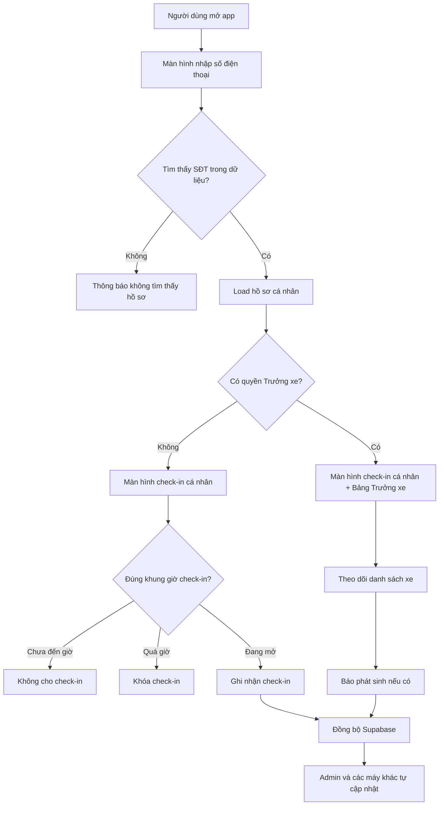
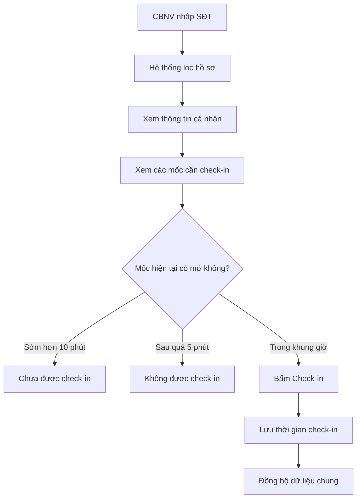
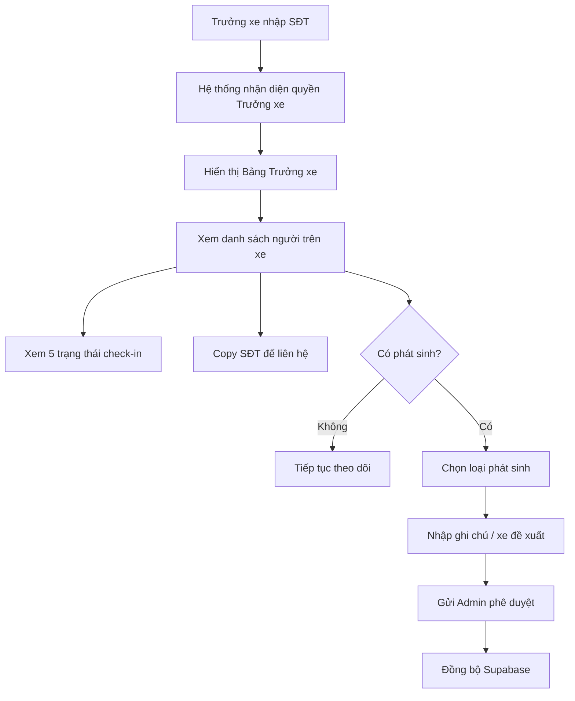
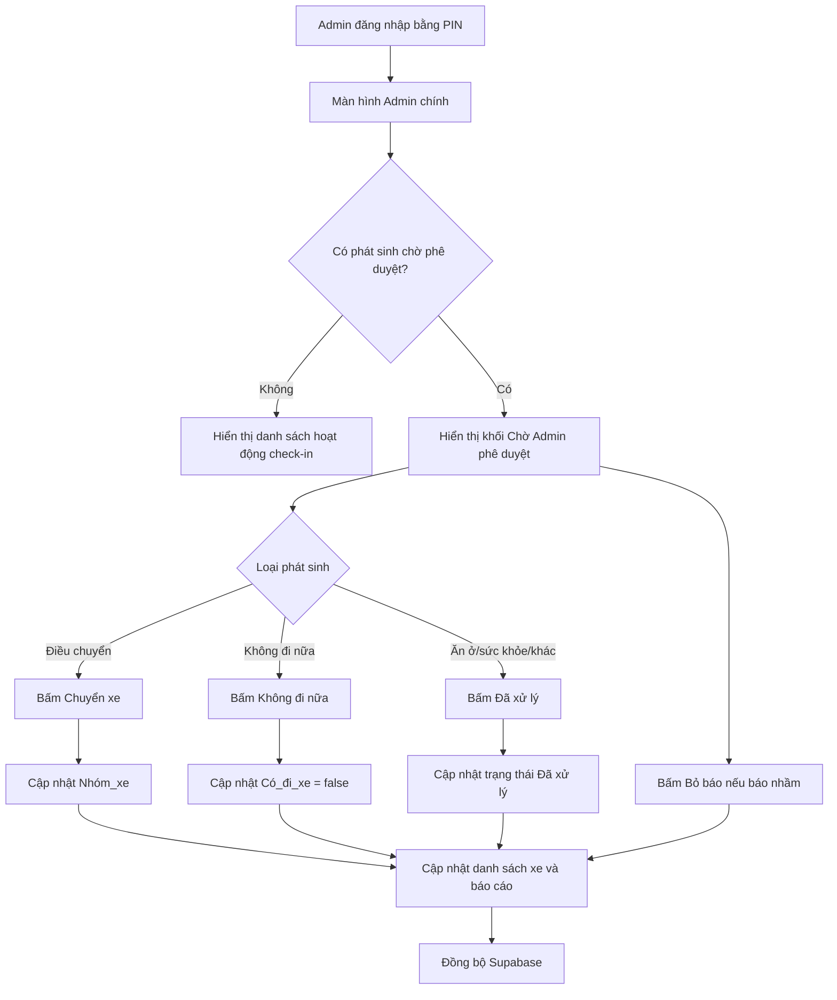
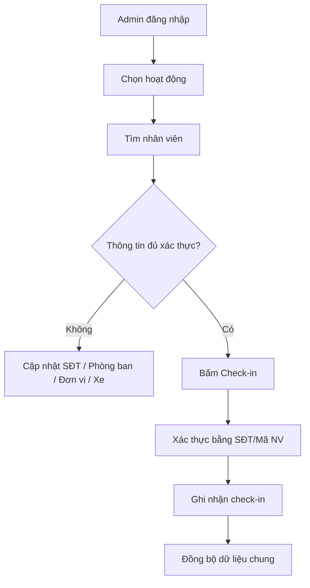
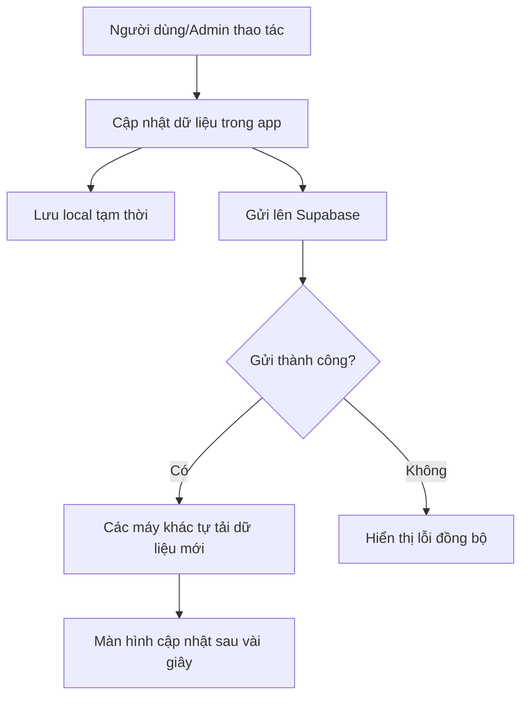

# Lưu đồ hoạt động app Check-in Du lịch 2026

## 1. Mục tiêu hệ thống

App dùng để CBNV tự check-in theo số điện thoại, Trưởng xe theo dõi danh sách xe và báo phát sinh, Admin quản lý dữ liệu, xử lý điều chuyển và theo dõi báo cáo.

## 2. Vai trò sử dụng

| Vai trò | Cách vào hệ thống | Quyền chính |
|---|---|---|
| CBNV | Nhập số điện thoại | Xem hồ sơ cá nhân, check-in các mốc được mở đúng giờ |
| Trưởng xe | Nhập số điện thoại có quyền `Truong_xe` | Xem danh sách xe, trạng thái check-in, copy SĐT, báo phát sinh |
| Admin | Bấm Admin và nhập PIN | Import/export dữ liệu, check-in thủ công, điều chuyển xe, xử lý phát sinh, xem báo cáo |

## 3. Lưu đồ tổng quan

## 4. Luồng CBNV tự check-in

## 5. Luồng Trưởng xe

## 6. Các loại phát sinh Trưởng xe có thể báo

| Loại phát sinh | Ý nghĩa | Admin xử lý |
|---|---|---|
| Báo điều chuyển | CBNV cần chuyển sang xe khác | Bấm `Chuyển xe` để đổi `Nhóm_xe` |
| Báo không đi nữa | CBNV không tham gia/không đi xe | Bấm `Không đi nữa`, loại khỏi danh sách xe |
| Phát sinh ăn uống | Thay đổi/thiếu suất/nhu cầu ăn uống | Bấm `Đã xử lý` sau khi xử lý |
| Phát sinh lưu trú | Vấn đề phòng ở/lưu trú | Bấm `Đã xử lý` sau khi xử lý |
| Đến muộn / chưa thấy người | Cần Admin nắm tình hình | Bấm `Đã xử lý` hoặc xử lý thủ công |
| Sức khỏe / cần hỗ trợ | Trường hợp cần hỗ trợ đặc biệt | Bấm `Đã xử lý` sau khi xử lý |
| Phát sinh khác | Tình huống ngoài danh mục | Admin đọc ghi chú và xử lý |

## 7. Luồng Admin xử lý phát sinh

## 8. Luồng Admin check-in thủ công

## 9. Luồng đồng bộ dữ liệu

## 10. Nguyên tắc an toàn thông tin

- Mỗi lần mở app đều quay về màn hình nhập số điện thoại.
- Không lưu số điện thoại đăng nhập của người trước vào trình duyệt.
- Không dùng chung màn hình Trưởng xe giữa các tab/người dùng.
- Dữ liệu check-in được đồng bộ chung, nhưng quyền xem màn hình được lọc lại theo số điện thoại nhập vào.
- Admin dùng PIN riêng để vào khu vực quản trị.

## 11. Các mốc check-in chính

| Mốc | Người cần check-in | Điều kiện mở |
|---|---|---|
| Xe đi | Người có đi xe | Mở trước giờ sự kiện 10 phút, khóa sau 5 phút |
| Trưa 12/7 | Người có suất ăn | Mở trước giờ sự kiện 10 phút, khóa sau 5 phút |
| Tối 12/7 | Người có suất ăn | Mở trước giờ sự kiện 10 phút, khóa sau 5 phút |
| Trưa 13/7 | Người có suất ăn | Mở trước giờ sự kiện 10 phút, khóa sau 5 phút |
| Xe về HN | Người có đi xe | Mở trước giờ sự kiện 10 phút, khóa sau 5 phút |

